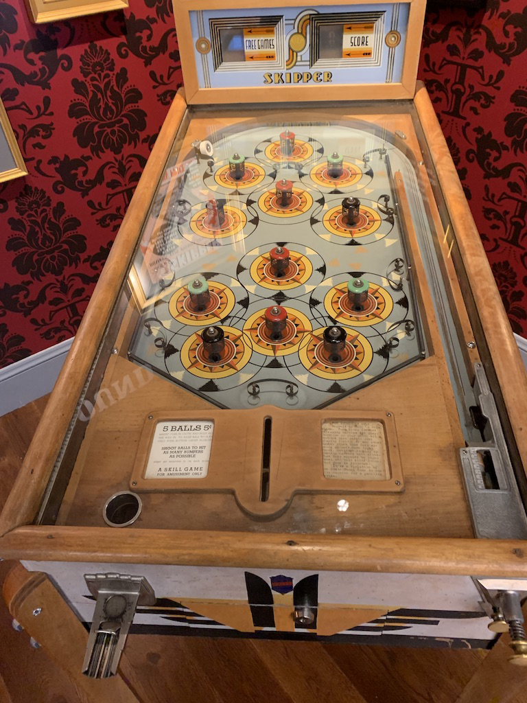

# Riemersma dither, in Chapel

https://chapel-lang.com

See https://www.compuphase.com/riemer.htm

This program uses [Gilbert Curve](https://github.com/jakubcerveny/gilbert).

# compile

Requires NetPBM.

```
chpl --fast ppmriemer.chpl 
```

# usage

```
ppmriemer --ifile=input.ppm --pfile=palette.ppm --ofile=output.ppm 
```

`palette` file should be produced by `pnmcolormap`.

# LICENSE

BSD 2-Clause "Simplified" License

# Example




Use a [8 color palette](example/p.ppm).


# Dyalog APL version

Compile `gilbert.dylib` by

```
cc -DAPL -shared -Wl,-install_name,gilbert.dylib -o gilbert.dylib gilbert.c
```

This APL version handles only PGM files.

```
   ('P4' 'out.pbm') writepnm⍨ priem (readpnm 'input.pgm')
```
