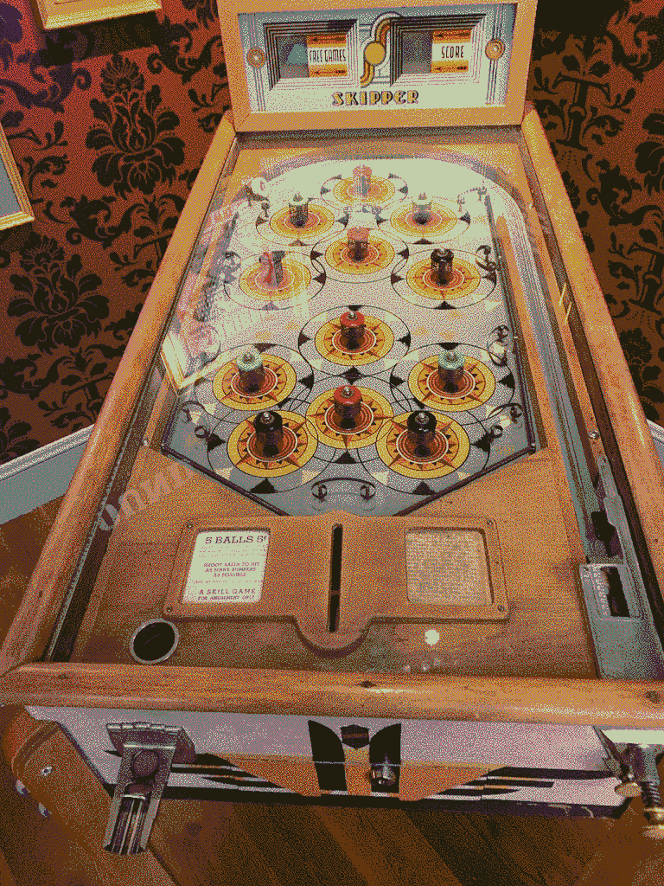

# Riemersma dither, in Chapel

https://chapel-lang.com

See https://www.compuphase.com/riemer.htm

This program uses [Gilbert Curve](https://github.com/jakubcerveny/gilbert).

# compile

Requires NetPBM.

```
chpl --fast ppmriemer.chpl 
```

# usage

```
ppmriemer --ifile=input.ppm --pfile=palette.ppm --ofile=output.ppm 
```

`palette` file should be produced by `pnmcolormap`.

# LICENSE

BSD 2-Clause "Simplified" License

# Example


Use a [8 color palette](example/p.ppm).



# Dyalog APL version

Compile `gilbert.dylib` by

```
cc -DAPL -shared -Wl,-install_name,gilbert.dylib -o gilbert.dylib gilbert.c
```

This APL version handles only PGM files.

```
   ('P4' 'out.pbm') writepnm⍨ priem (readpnm 'input.pgm')
```

# Misc

I write the Chapel one because APL cannot give very fine control of space usage
so for larger colored images it is impossible to processing the rank-3 array
without a very high workspace size parameter, for a 26MB raster PPM file 1GB
`WS_SIZE` is not sufficient for use. It uses its own PNM file parser so it is
much strict about the input file format, it needs to be in the raster variant,
and Maxval is assumed to be 255.

Currently Chapel's sequential iterator is super slow and I doubt the extra
overhead of writing the function in Chapel, so I decide it is better to write
the gilbert curve generating function in C, same as the APL one. It relies on
libnetpbm to handle PPM files, so it can use any valid PNM file as input.

For a `4502 x 2016` image, the PGM to PBM function in APL takes less than a sec.

The PPM to PPM command line compiled from Chapel takes about 7 minutes. The
libnetpbm's file reader is not optimized for parallel array processing, This
could be the reason for the rather long execution time because the input image
is updated and accessed in-place, not in a cache friendly pattern.
